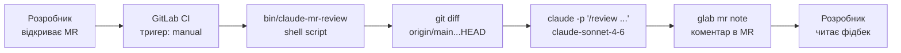

# AI & Development in 2026

Як AI-агенти змінюють розробку вже сьогодні

<div class="pt-12">
  <span class="px-2 py-1 rounded cursor-pointer" hover="bg-white bg-opacity-10">
    Вадим Бондаренко
  </span>
</div>

<div class="abs-br m-6 flex gap-2">
  <span class="text-sm opacity-50">Лютий 2026</span>
</div>

<!--
Вітаю всіх! Сьогодні поговоримо про те, як AI змінює нашу щоденну роботу розробника прямо зараз — не в майбутньому.
Покажу конкретні інструменти, практики та підводні камені. Будуть реальні приклади з виробничих проектів.
Наприкінці — час для питань і дискусії.
-->

---
layout: center
class: text-center
---

# AI — це вже стандарт

<div class="grid grid-cols-3 gap-12 mt-12">
  <div>
    <div class="text-6xl font-bold text-blue-400">73%</div>
    <div class="mt-2 text-sm opacity-70">розробників використовують AI-інструменти</div>
    <div class="mt-1 text-xs opacity-40"><a href="https://github.blog/news-insights/octoverse/octoverse-2024/" target="_blank" class="underline">GitHub Octoverse 2024</a></div>
  </div>
  <div>
    <div class="text-6xl font-bold text-green-400">88%</div>
    <div class="mt-2 text-sm opacity-70">компаній використовують AI хоча б в одній функції</div>
    <div class="mt-1 text-xs opacity-40"><a href="https://www.mckinsey.com/capabilities/quantumblack/our-insights/the-state-of-ai" target="_blank" class="underline">McKinsey State of AI 2025</a></div>
  </div>
  <div>
    <div class="text-6xl font-bold text-purple-400">55%</div>
    <div class="mt-2 text-sm opacity-70">швидше виконуються типові задачі з AI</div>
    <div class="mt-1 text-xs opacity-40"><a href="https://github.blog/news-insights/research/research-quantifying-github-copilots-impact-on-developer-productivity-and-happiness/" target="_blank" class="underline">GitHub Copilot Research, 2022</a></div>
  </div>
</div>

<div class="mt-10 p-4 bg-white bg-opacity-5 rounded-xl max-w-md mx-auto border border-gray-500 border-opacity-20">
  <div class="flex items-center gap-2 text-xs opacity-50 mb-2">
    <span class="font-bold">@karpathy</span> · Jan 2023
  </div>
  <div class="text-base italic">"The hottest new programming language is English"</div>
  <a href="https://x.com/karpathy/status/1617979122625712128" class="text-xs opacity-30 mt-2 block">x.com/karpathy</a>
</div>

<!--
97% — це майже всі. Хто з вас вже використовує AI щодня? (пауза для рук)
78% компаній — це не стартапи, це Enterprise. Рішення прийнято на рівні CTO.
55% швидше — не означає "пишемо менше коду". Означає "вирішуємо більше проблем за той самий час".
Karpathy — один з творців GPT-4. Якщо він каже "English is the new programming language" — це не метафора.
-->

---
layout: center
---

# "За 1 годину те, що команда робила рік"

<div class="mt-8 max-w-2xl mx-auto">

<div class="p-6 bg-white bg-opacity-5 rounded-xl border border-gray-500 border-opacity-20">

<div class="text-sm opacity-50 mb-4">Jaana Dogan · Principal Engineer @ Google</div>

<div class="text-xl leading-relaxed mb-4">

Claude Code побудував **distributed agent orchestration system** приблизно за годину — задачу, над якою команда Google працювала **рік без результату**.

</div>

<div class="text-base opacity-70 italic">

"Quality and efficiency gains in this domain are beyond what anyone could have imagined so far."

</div>

</div>

<div class="text-xs opacity-30 mt-4 text-center"><a href="https://the-decoder.com/google-engineer-says-claude-code-built-in-one-hour-what-her-team-spent-a-year-on/" target="_blank">the-decoder.com</a></div>

</div>

---
layout: center
---

# Уточнення · Update Jan 4, 2026

<div class="mt-6 max-w-2xl mx-auto">

<div class="p-6 bg-white bg-opacity-5 rounded-xl border border-gray-500 border-opacity-20 text-sm">

<div class="text-xs opacity-50 mb-4">Jaana Dogan · уточнила наступного дня</div>

<v-clicks>

- Google будував **кілька версій системи впродовж року** — з різними трейдофами, без переможця
- Коли агенту дали **найкращі ідеї як стартову точку** — він зробив робочу версію за ~годину
- Результат **не production-grade**, але **"useful starting point"**
- *"I didn't prompt in depth about design choices yet CC was able to give me some good recommendations"*
- Нові артефакти **"free from baggage"** — без накопиченого технічного боргу

</v-clicks>

</div>

<div v-click class="mt-4 p-3 bg-yellow-500 bg-opacity-10 rounded-lg text-xs border border-yellow-500 border-opacity-20">

💡 Ключовий інсайт: AI не замінює рік досвіду — він прискорює реалізацію вже здобутих знань.

</div>

</div>

---
layout: section
transition: fade
---

# Еволюція: від ChatGPT до AI-агентів

Як ми дійшли до того, де ми зараз

---

# Хронологія AI в розробці

<div class="grid grid-cols-2 gap-x-8 gap-y-6 mt-8">

<div v-click>

### 2022 — ChatGPT
- "Розумний чат" для copy-paste коду
- Окреме вікно браузера
- Контекст = один промпт

</div>

<div v-click>

### 2023 — IDE-інтеграція
- Copilot Chat, CodeWhisperer, IntelliJ AI
- AI-чат прямо в редакторі — новий стандарт
- Контекст = поточний файл

</div>

<div v-click>

### 2024 — Cursor, Aider
- AI почав редагувати файли напряму
- Multi-file контекст
- Перші "агентні" можливості

</div>

<div v-click>

### 2025-2026 — Agentic AI
- AI як автономний виконавець задач
- Планує, виконує, тестує, виправляє
- Контекст = весь проект + інструменти

</div>

</div>

---
layout: section
transition: fade
---

# Рейтинги та бенчмарки моделей

Як обрати правильну модель для задачі

---

# Де дивитися рейтинги

<div class="grid grid-cols-2 gap-12 mt-8">

<div>

### LMArena (arena.ai)

<v-clicks>

- "Сліпе" порівняння моделей людьми
- ELO-рейтинг (як у шахах)
- Людина бачить 2 відповіді — обирає кращу
- Не знаючи яка модель яка
- Найоб'єктивніший рейтинг

</v-clicks>

<!-- Тут можна вставити скріншот arena.ai -->

</div>

<div>

### SWE-bench

<v-clicks>

- Бенчмарк спеціально для коду
- Реальні GitHub issues як завдання
- Агент має знайти баг і зафіксити
- Вимірює end-to-end здатність
- Найрелевантніший для розробників

</v-clicks>

<!-- Тут можна вставити скріншот swebench.com -->

</div>

</div>

<div class="mt-6 text-sm opacity-60 text-center">

Також: Aider Polyglot Leaderboard, HumanEval, MMLU, LiveCodeBench

</div>

---
layout: center
class: text-center
---

# Топ моделей для коду · Лютий 2026

<div class="flex flex-col items-center mt-2">


<div class="text-xs opacity-30 mt-3">
  <a href="https://arena.ai/uk/leaderboard/code/webdev" target="_blank">arena.ai/leaderboard/code/webdev</a> · Feb 24, 2026 · 171 212 votes · 46 models
</div>

</div>

---
class: text-center
---

# Які бувають агенти для розробки?

<div class="grid grid-cols-2 gap-6 mt-8 text-left max-w-3xl mx-auto">

<div class="p-4 bg-blue-500 bg-opacity-10 rounded-xl border border-blue-500 border-opacity-30">
  <div class="text-lg font-bold mb-2">🖥️ IDE-агенти</div>
  <div class="text-xs opacity-60 mb-2 uppercase tracking-wide">Human in the Loop</div>
  <div class="text-sm opacity-80">Cursor · GitHub Copilot · Windsurf</div>
  <div class="text-xs opacity-50 mt-2">Щоденна розробка, ви контролюєте кожен крок</div>
</div>

<div class="p-4 bg-green-500 bg-opacity-10 rounded-xl border border-green-500 border-opacity-30">
  <div class="text-lg font-bold mb-2">💻 CLI-агенти</div>
  <div class="text-xs opacity-60 mb-2 uppercase tracking-wide">Terminal</div>
  <div class="text-sm opacity-80">Claude Code · Aider · Gemini CLI</div>
  <div class="text-xs opacity-50 mt-2">CI/CD, batch-операції, автоматизація</div>
</div>

<div class="p-4 bg-purple-500 bg-opacity-10 rounded-xl border border-purple-500 border-opacity-30">
  <div class="text-lg font-bold mb-2">🎨 Спеціалізовані</div>
  <div class="text-xs opacity-60 mb-2 uppercase tracking-wide">Domain-specific</div>
  <div class="text-sm opacity-80">v0.dev · Bolt.new · Figma AI</div>
  <div class="text-xs opacity-50 mt-2">Прототипи, UI mockups, швидкий MVP</div>
</div>

<div class="p-4 bg-orange-500 bg-opacity-10 rounded-xl border border-orange-500 border-opacity-30">
  <div class="text-lg font-bold mb-2">🤖 Автономні</div>
  <div class="text-xs opacity-60 mb-2 uppercase tracking-wide">Cloud / Background</div>
  <div class="text-sm opacity-80">Devin · Copilot Workspace · Background Agents</div>
  <div class="text-xs opacity-50 mt-2">Довгі задачі, паралельна робота</div>
</div>

</div>

---

# Огляд типів агентів

<div class="grid grid-cols-2 gap-6 mt-4 text-sm">

<div>

### 🖥️ IDE-агенти (Human in the Loop)

- **Cursor** ($20/міс) — форк VS Code, agent mode, MCP
- **GitHub Copilot** ($10-19) — autocomplete + chat + agent
- **Windsurf** ($0-15) — Cascade, безкоштовний tier
- **JetBrains AI** — для PhpStorm фанів

**Коли:** Щоденна розробка, ви контролюєте кожен крок

</div>

<div>

### 💻 CLI-агенти (Terminal)

- **Claude Code** — найпотужніший, PR + коміти
- **Aider** — open source, будь-яка модель
- **Gemini CLI** — безкоштовний, 1M контекст

**Коли:** CI/CD, batch-операції, автоматизація

</div>

<div>

### 🎨 Спеціалізовані

- **v0.dev** ($20) — UI-компоненти (React/Tailwind)
- **Bolt.new / Lovable** — повні аплікації з промпту
- **Figma AI** — генерація дизайну

**Коли:** Прототипи, UI mockups, швидкий MVP

</div>

<div>

### 🤖 Автономні / Cloud

- **Devin** (~$500) — "AI software engineer"
- **Copilot Workspace** — від issue до PR в GitHub
- **Background Agents** (Cursor) — працюють паралельно

**Коли:** Довгі задачі, паралельна робота, потребують нагляду

</div>

</div>
---

# Agent Loop — як агент думає і діє

<div class="grid grid-cols-2 gap-8 mt-4 items-center">

<div>

<div class="text-xs opacity-30 mt-2"><a href="https://code.visualstudio.com/docs/copilot/core-concepts#_agent-loop" target="_blank">code.visualstudio.com — GitHub Copilot Core Concepts</a></div>
</div>

<div class="text-sm">

<v-clicks>

- **Understand** — читає файли, шукає по кодбейсу, вивчає документацію
- **Act** — редагує код, виконує команди, встановлює залежності, викликає API
- **Validate** — запускає тести, перевіряє помилки компілятора, ревьюає зміни
- Якщо щось не так — **ітерує** знову

</v-clicks>

<div v-click class="mt-6 p-3 bg-blue-500 bg-opacity-10 rounded-lg border border-blue-500 border-opacity-20">

Агент сам вирішує скільки ітерацій потрібно. Ти можеш зупинити, додати контекст або перенаправити в будь-який момент.

</div>

</div>

</div>

---
layout: center
---

# Vibe Coding

<div class="mt-6 p-5 bg-white bg-opacity-5 rounded-xl max-w-xl mx-auto border border-gray-500 border-opacity-20">
  <div class="flex items-center gap-2 text-sm opacity-50 mb-3">
    <span class="font-bold">@karpathy</span> · Feb 2025
  </div>
  <div class="text-lg leading-relaxed">There's a new kind of coding I call <span class="text-purple-400 font-bold">"vibe coding"</span>, where you fully give in to the vibes, embrace exponentials, and forget that the code even exists.</div>
  <a href="https://x.com/karpathy/status/1886192184808149383" class="text-xs opacity-30 mt-3 block">x.com/karpathy</a>
</div>

<div class="mt-6 text-sm opacity-60 text-center">

Слово року за версією Collins Dictionary 2025

</div>

<!--
Хто чув термін "vibe coding"? (пауза)
Karpathy описує підхід "дай AI промпт і не думай про код взагалі".
Це ОК для прототипів та learning. Але не для production.
Далі покажу чому — і що ми робимо натомість.
-->

---
layout: center
class: text-center
---

# Vibe Coding на практиці


<div class="mt-4 text-center">
<div class="text-lg"><span class="text-red-400 font-bold">AI Slop</span> — код/контент що виглядає правильно, але є generic сміттям</div>
<div class="text-sm opacity-50 mt-1">Неіснуючі API, вигадані бібліотеки, "працює але не так", hallucinations</div>
</div>

---
layout: center
---

# Agentic Engineering

<div class="mt-6 p-5 bg-white bg-opacity-5 rounded-xl max-w-xl mx-auto border border-gray-500 border-opacity-20">
  <div class="flex items-center gap-2 text-sm opacity-50 mb-3">
    <span class="font-bold">@karpathy</span> · Feb 2026
  </div>
  <div class="text-lg leading-relaxed">One year ago I mass-coined "vibe coding". Today I'd like to mass-coin <span class="text-blue-400 font-bold">"agentic engineering"</span> — there is an art & science and expertise to it.</div>
  <a href="https://x.com/karpathy/status/2019137879310836075" class="text-xs opacity-30 mt-3 block">x.com/karpathy</a>
</div>

<div class="grid grid-cols-2 gap-12 mt-8 text-center">
  <div>
    <div class="text-xl font-bold opacity-40 line-through">Vibe Coding</div>
    <div class="mt-2 text-sm opacity-40">Промпт → код → "якось працює"</div>
  </div>
  <div>
    <div class="text-xl font-bold text-blue-400">Agentic Engineering</div>
    <div class="mt-2 text-sm opacity-70">Контекст → агент → review → результат</div>
  </div>
</div>

---
layout: section
transition: fade
---

# Context Engineering

Від "як попросити" до "що показати AI"

---
layout: center
---

# Чому Context Engineering?

<div class="grid grid-cols-2 gap-6 mt-6 max-w-3xl mx-auto">

<div class="p-4 bg-white bg-opacity-5 rounded-xl border border-gray-500 border-opacity-20">
  <div class="flex items-center gap-2 text-xs opacity-50 mb-2">
    <span class="font-bold">@karpathy</span> · 2025
  </div>
  <div class="text-sm">I think the word "prompt engineering" is grossly over-indexed. The real skill is <span class="text-blue-400 font-bold">context engineering</span> — the art of filling the context window with just the right information for the next step.</div>
  <a href="https://x.com/karpathy/status/2019137879310836075" class="text-xs opacity-30 mt-2 block">x.com/karpathy</a>
</div>

<div class="p-4 bg-white bg-opacity-5 rounded-xl border border-gray-500 border-opacity-20">
  <div class="flex items-center gap-2 text-xs opacity-50 mb-2">
    <span class="font-bold">Anthropic Engineering Blog</span> · Sep 2025
  </div>
  <div class="text-sm font-bold mb-2">"Effective context engineering for AI agents"</div>
  <div class="text-xs opacity-60">Context is a critical but finite resource for AI agents. Building with LLMs is becoming less about finding the right words and more about: <span class="italic">"what configuration of context is most likely to generate the desired behavior?"</span></div>
  <a href="https://www.anthropic.com/engineering/effective-context-engineering-for-ai-agents" class="text-xs opacity-30 mt-2 block">anthropic.com/engineering</a>
</div>

</div>

---

# Prompt Engineering vs Context Engineering

<div class="grid grid-cols-2 gap-8 mt-8">

<div class="p-4 bg-gray-500 bg-opacity-10 rounded-xl border border-gray-500 border-opacity-20">

### Prompt Engineering (2023)

<v-clicks>

- Фокус на **одному запиті**
- "Як краще сформулювати питання"
- Один промпт → одна відповідь
- Трюки: "Think step by step", "Act as senior dev"
- Знання: **у формулюванні промпту**

</v-clicks>

</div>

<div class="p-4 bg-blue-500 bg-opacity-10 rounded-xl border border-blue-500 border-opacity-30">

### Context Engineering (2025-2026)

<v-clicks>

- Фокус на **всьому що AI бачить**
- "Що показати AI і що приховати"
- System prompt + rules + файли + пам'ять + MCP
- Структура проекту, конвенції, приклади коду
- Знання: **в налаштуванні середовища**

</v-clicks>

</div>

</div>

<div v-click class="mt-6 p-3 bg-blue-500 bg-opacity-10 rounded-lg text-sm text-center">

**Той самий промпт + кращий контекст = значно кращий результат** — без зміни моделі

</div>

---

# Context Engineering: дві крайнощі

<div class="grid grid-cols-2 gap-8 mt-8">

<div class="p-4 bg-red-500 bg-opacity-10 rounded-lg">

### Замало контексту

```
Напиши API endpoint для створення юзера
```

<v-clicks>

- AI вигадує архітектуру сам
- Generic код, не для вашого проекту
- Доведеться переписувати

</v-clicks>

</div>

<div class="p-4 bg-red-500 bg-opacity-10 rounded-lg">

### Забагато контексту

```
Ось весь проект, всі файли, вся
документація, всі тести...
Зроби endpoint.
```

<v-clicks>

- Context rot — модель "губиться"
- Agent drift — робить не те
- Дорого (токени = гроші)

</v-clicks>

</div>

</div>

---

# Довший контекст = гірший результат

<div class="grid grid-cols-2 gap-8 mt-6 items-center">

<div>


<div class="text-xs opacity-30 mt-1"><a href="https://research.trychroma.com/context-rot" target="_blank">research.trychroma.com/context-rot</a></div>

</div>

<div class="p-6 bg-red-500 bg-opacity-10 rounded-xl border border-red-500 border-opacity-30 text-2xl leading-relaxed">

Більше контексту<br/>≠<br/>кращий результат

</div>

</div>

---

# Як контекст ламається — 4 типи збоїв

<div class="grid grid-cols-2 gap-4 mt-4 text-sm">

<div class="p-3 bg-red-500 bg-opacity-10 rounded-lg border border-red-500 border-opacity-20">

**☠️ Context Poisoning**

Галюцинація потрапляє в контекст і далі підсилює себе. Агент будує стратегію на основі вигаданих даних.

</div>

<div class="p-3 bg-orange-500 bg-opacity-10 rounded-lg border border-orange-500 border-opacity-20">

**😵 Context Distraction**

При великому контексті модель повторює старі паттерни замість нового міркування.

</div>

<div class="p-3 bg-yellow-500 bg-opacity-10 rounded-lg border border-yellow-500 border-opacity-20">

**🌫️ Context Confusion**

Зайва інформація заважає. Llama 3.1 8B впоралася з 19 інструментами, але "провалилася" з 46.

</div>

<div class="p-3 bg-purple-500 bg-opacity-10 rounded-lg border border-purple-500 border-opacity-20">

**⚔️ Context Clash**

Суперечлива інформація з різних джерел. Microsoft/Salesforce: -39% точності через накопичені протиріччя.

</div>

</div>

<div class="text-xs opacity-30 mt-4"><a href="https://www.dbreunig.com/2025/06/22/how-contexts-fail-and-how-to-fix-them.html" target="_blank">dbreunig.com — How Contexts Fail and How to Fix Them</a></div>

---

# Agent Drift

**Визначення:** Поступове відхилення AI-агента від поставленої задачі.

<div class="grid grid-cols-2 gap-8 mt-4">

<div>

### Математика drift

<div class="mt-4 p-4 bg-red-500 bg-opacity-10 rounded-lg font-mono text-center">
  <div class="text-sm opacity-60 mb-2">Якщо кожен крок вірний на 99%:</div>
  <div class="text-xl"><code>pow(0.99, 100) = 0.366</code></div>
  <div class="text-sm opacity-60 mt-2">100 кроків → <span class="text-red-400 font-bold">лише 37% шанс</span> що все правильно</div>
</div>

<div class="mt-3 text-xs opacity-50">

| Кроків | pow(0.99, n) | Результат |
|---|---|---|
| 10 | 0.904 | Ще ок |
| 50 | 0.605 | Підкидаєш монетку |
| 100 | 0.366 | Скоріш за все зламано |

</div>

</div>

<div>

<div v-click class="mt-3 p-2 bg-yellow-500 bg-opacity-10 rounded-lg text-xs">

💡 "Попросив додати кнопку — агент відрефакторив пів проекту і переписав роутинг"

</div>

</div>

</div>

---

# Рішення: правильний контекст

<div class="grid grid-cols-2 gap-8 mt-6">

<div class="p-4 bg-green-500 bg-opacity-10 rounded-lg">

### Приклад правильного контексту

```
Endpoint для створення юзера.
Стек: Symfony 7, Doctrine ORM.
Приклад: src/Entity/Product.php
Валідація: Assert атрибути.
Тести: tests/Api/
```

<v-clicks>

- Мінімум потрібної інформації
- Конкретні приклади з проекту
- Чіткі обмеження і конвенції

</v-clicks>

</div>

<div>

### Як цього досягти

<div v-click class="mt-4 p-3 bg-blue-500 bg-opacity-10 rounded-lg text-xs">

Anthropic: "Find the <span class="text-blue-400 font-bold">smallest possible set</span> of high-signal tokens that maximize the desired outcome"

</div>

</div>

</div>

---

# Що входить в контекст AI-агента

<div class="grid grid-cols-2 gap-8 mt-6">

<div>

<v-clicks>

- 🧠 **System Prompt** — базові інструкції та роль
- 💬 **Історія діалогу** — попередні повідомлення
- 📁 **Файли проекту** — код, конфіги, схеми
- 🔧 **Tools/MCP Tools** — доступні інструменти та API
- 📋 **Rules & Instructions** — правила проекту
- ⚡ **Skills** — готові шаблони дій
- 🗒️ **Memory / Notes** — нотатки між сесіями

</v-clicks>

</div>

<div class="flex items-center justify-center">
<div class="text-center">
  <div v-click class="text-4xl font-mono font-bold text-blue-400 mb-4">Якість =<br/>Модель × Контекст</div>
  <div v-click class="text-sm opacity-60 mt-2 max-w-xs">Навіть найкраща модель дасть поганий результат з поганим контекстом</div>
</div>
</div>

</div>

---

# System Prompt: невидима основа

Кожен AI-інструмент має прихований системний промпт — сотні рядків інструкцій, які формують його поведінку.
<div class="mt-4 relative">
  
</div>

<div class="mt-2 text-xs opacity-40">

🔗 [github.com/x1xhlol/system-prompts-and-models-of-ai-tools](https://github.com/x1xhlol/system-prompts-and-models-of-ai-tools)

</div>

---

# Файли проекту: як AI знаходить контекст

<div class="grid grid-cols-2 gap-8 mt-6">

<div class="p-4 bg-blue-500 bg-opacity-10 rounded-xl border border-blue-500 border-opacity-20">

### Автоматично — Semantic Search

<v-clicks>

- Cursor індексує весь проект у фоні
- Пошук за **змістом**, не за текстом
- _"Де обробляється автентифікація?"_ → знайде весь пов'язаний код
- Агент сам вирішує які файли взяти

</v-clicks>

</div>

<div class="p-4 bg-purple-500 bg-opacity-10 rounded-xl border border-purple-500 border-opacity-20">

### Явно — @Mentions

<v-clicks>

- Ти контролюєш що AI бачить
- `@Files` / `@Folders` — прикріпити файл чи папку
- `@Code` — конкретний фрагмент
- `@Docs` — документація по URL
- `#file`, `#fetch` у VS Code Copilot

</v-clicks>

</div>

</div>

---
layout: section
---

# Tools

---

# Function Calling — AI отримує інструменти

OpenAI 2023: модель може викликати ваші функції замість того щоб просто відповідати текстом.
<span class="text-xs opacity-40"><a href="https://developers.openai.com/api/docs/guides/function-calling/" target="_blank">developers.openai.com/api/docs/guides/function-calling</a></span>

<div class="grid grid-cols-2 gap-6 mt-4">

<div>

### Як це працює

<v-clicks>

- Описуєш функцію у JSON Schema
- Модель вирішує коли її викликати
- Повертає аргументи → ти виконуєш → передаєш результат назад
- Модель формує фінальну відповідь

</v-clicks>

</div>

<div v-click>

```json
{
  "name": "get_user",
  "description": "Отримати дані юзера з БД",
  "parameters": {
    "type": "object",
    "properties": {
      "user_id": { "type": "integer" }
    }
  }
}
```

</div>

</div>

<div v-click class="mt-4 p-3 bg-yellow-500 bg-opacity-10 rounded-lg text-sm border border-yellow-500 border-opacity-20">

**Проблема:** кожен провайдер — свій формат. Cursor інтегрує по-своєму, Copilot — по-своєму, Claude — по-своєму.

</div>

---

# MCP — Model Context Protocol

<div class="grid grid-cols-2 gap-8 mt-4">

<div>

### Проблема до MCP

```
Cursor → GitHub  (своя інтеграція)
Copilot → GitHub (своя інтеграція)
Claude code → GitHub (своя інтеграція)
...
```

<div class="text-sm opacity-60 mt-2">N агентів × M інструментів = N×M інтеграцій</div>

</div>

<div>

### Після MCP

```
Cursor  ─┐
Claude  ─┤─ MCP ─── Web Browser
Copilot ─┘       ├── GitHub
                 ├── PostgreSQL
                 └── Figma
```

<div class="text-sm opacity-60 mt-2">N агентів + M інструментів = N+M інтеграцій</div>

</div>

</div>

<div v-click class="mt-6 grid grid-cols-3 gap-4 text-sm">
  <div class="p-2 bg-white bg-opacity-5 rounded-lg text-center">
    <div class="font-bold text-blue-400">Відкритий стандарт</div>
    <div class="text-xs opacity-60 mt-1">Anthropic, листопад 2024</div>
  </div>
  <div class="p-2 bg-white bg-opacity-5 rounded-lg text-center">
    <div class="font-bold text-green-400">Будь-який агент</div>
    <div class="text-xs opacity-60 mt-1">Cursor, Copilot, Claude Code</div>
  </div>
  <div class="p-2 bg-white bg-opacity-5 rounded-lg text-center">
    <div class="font-bold text-purple-400">Open source</div>
    <div class="text-xs opacity-60 mt-1">anthropic.com/news/model-context-protocol</div>
  </div>
</div>

<!--
MCP — це Game changer для enterprise. Замість n інтеграцій (Cursor→Jira, Copilot→Jira...) — один MCP сервер.
Якщо у вас є внутрішні системи (Confluence, корпоративний Git, БД) — MCP дозволяє підключити їх до будь-якого агента.
Anthropic відкрили специфікацію, тому конкуренти теж підтримують: OpenAI, Google.
-->

---

# MCP — як це працює

<div class="grid grid-cols-2 gap-8 mt-4">

<div>

### Приклад: Chrome DevTools MCP

<div class="mt-2 space-y-2 text-sm">

<div v-click class="flex items-start gap-3 p-2 bg-blue-500 bg-opacity-10 rounded">
  <span class="text-blue-400 font-mono font-bold mt-0.5">1</span>
  <span>Ти: <em>"Перевір форму реєстрації — чи немає помилок у консолі"</em></span>
</div>

<div v-click class="flex items-start gap-3 p-2 bg-white bg-opacity-5 rounded">
  <span class="text-gray-400 font-mono font-bold mt-0.5">2</span>
  <span>Агент викликає Chrome DevTools MCP</span>
</div>

<div v-click class="flex items-start gap-3 p-2 bg-white bg-opacity-5 rounded">
  <span class="text-gray-400 font-mono font-bold mt-0.5">3</span>
  <span>Навігує на сторінку, заповнює форму, знімає скріншот, читає console.log</span>
</div>

<div v-click class="flex items-start gap-3 p-2 bg-green-500 bg-opacity-10 rounded">
  <span class="text-green-400 font-mono font-bold mt-0.5">4</span>
  <span>Повертає: <em>"TypeError: cannot read 'email' — рядок 42 у form.js"</em> і фіксить</span>
</div>

</div>

</div>

<div>

### Популярні MCP-сервери

<div v-click class="grid grid-cols-2 gap-2 mt-2 text-xs">
  <div class="p-2 bg-white bg-opacity-5 rounded">🗄️ <b>PostgreSQL</b><br/><span class="opacity-60">читає схему, робить запити</span></div>
  <div class="p-2 bg-white bg-opacity-5 rounded">🐙 <b>GitHub</b><br/><span class="opacity-60">PR, issues, код</span></div>
  <div class="p-2 bg-white bg-opacity-5 rounded">🌐 <b>Browser</b><br/><span class="opacity-60">відкриває, клікає, скріншоти</span></div>
  <div class="p-2 bg-white bg-opacity-5 rounded">🎨 <b>Figma</b><br/><span class="opacity-60">читає дизайн → код</span></div>
</div>

</div>

</div>
---

# Context7 — актуальна документація в контексті

MCP-сервер який підтягує **свіжу документацію** будь-якої бібліотеки прямо в контекст агента.

<div class="grid grid-cols-2 gap-8 mt-4 items-start">

<div>

### Проблема без Context7

<v-clicks>

- AI навчений на даних до певної дати
- Знає старі API, яких вже немає
- Галюцинує методи і параметри

</v-clicks>

<div v-click class="mt-3 text-xs opacity-40">

<a href="https://context7.com" target="_blank">context7.com</a> · 70 887 бібліотек

</div>

<div v-click class="mt-3 p-2 bg-white bg-opacity-5 rounded-lg text-xs">

VS Code Copilot: вбудована тула <code>#fetch &lt;url&gt;</code> — AI сам витягує і парсить сторінку доки за посиланням

</div>


</div>

<div>


</div>

</div>

---
layout: section
---

# Memory

---

# Агент не пам'ятає вас

<div class="grid grid-cols-2 gap-8 mt-6">

<div class="p-4 bg-red-500 bg-opacity-10 rounded-lg">

### Кожна нова сесія — чистий аркуш

<v-clicks>

- Не знає вашого стеку
- Не знає конвенцій команди
- Не знає що вже обговорювали
- Не знає які файли не чіпати

</v-clicks>

<div v-click class="mt-4 text-sm italic opacity-60">

"Знову пояснюю що у нас Symfony і не треба використовувати Laravel-підходи..."

</div>

</div>

<div>

### Як вирішували це спочатку

<v-clicks>

- Копіювати контекст вручну щоразу
- Починати кожен чат з довгого опису проекту
- Сподіватися що AI "здогадається"

</v-clicks>

</div>

</div>

---

# Кастомні промпти

Збережені шаблони для задач які виконуєш постійно — не пишеш щоразу, викликаєш одним кліком.

<div class="mt-6 max-w-xl mx-auto">

### GitHub Copilot — `.github/prompts/`

```markdown
---
mode: agent
description: Code review за нашими стандартами
---
Зроби code review цього коду.
Перевір: SOLID, PSR-12, безпеку,
SQL ін'єкції, N+1 запити.
Дай конкретні пропозиції з прикладами.
```

<div class="text-xs opacity-50 mt-2">Викликається через <code>/review</code> в Copilot Chat</div>

</div>

<div v-click class="mt-4 p-3 bg-green-500 bg-opacity-10 rounded-lg text-sm border border-green-500 border-opacity-20">

Один промпт — вся команда використовує однаковий підхід до review, генерації тестів, рефакторингу

</div>

---

# Кастомні команди

<div class="grid grid-cols-2 gap-6 mt-4">

<div>

### Що це

<v-clicks>

- Власні slash-команди у вашому проекті
- Виконують складні сценарії одним викликом
- Зберігаються в `.github/prompts/` — для всієї команди

</v-clicks>

<div v-click class="mt-4">

### Приклади

- `/functional-tests` — написати функціональні тести
- `/code-review` — review за стандартами команди
- `/explain` — пояснити вибраний код

</div>

</div>

<div v-click>

### `.github/prompts/functional-tests.prompt.md`

```markdown
---
mode: agent
description: Написати функціональні тести контролера
---
Напиши функціональні тести для цього контролера.

- Використай ApiTestCase
- Покрий: 200, 400, 401, 403, 404
- Використовуй DataProvider
- Назви методів: test<Action><Scenario>
  напр. testCreateUserReturns201()
- Запусти після: ./vendor/bin/phpunit
```

<div class="text-xs opacity-50 mt-1">Виклик: відкрити контролер → <code>/functional-tests</code> в Copilot Chat</div>

</div>

</div>

---
layout: section
transition: fade
---

# Rules & Instructions

Як керувати поведінкою AI-агента

---

# Rules & Instructions: контекст на автопілоті

<div class="grid grid-cols-2 gap-6 mt-4">

<div>

### Де зберігаються

```
my-project/
├── CLAUDE.md               ← Claude Code
└── .github/
    ├── copilot-instructions.md  ← Copilot
    └── instructions/
        ├── general.instructions.md  ← *
        ├── php.instructions.md      ← **/*.php
        └── tests.instructions.md    ← **/*Test.php
```

<div class="text-xs opacity-50 mt-2">Більшість інструментів підтримують glob-патерни — різні правила для різних файлів і папок</div>

</div>

<div>

### Приклад файлів з `applyTo`

```markdown
---
applyTo: "**/*.php"
---
## Stack
Symfony 7.4, PHP 8.4, Doctrine ORM, PostgreSQL

## Conventions
- snake_case for DB columns
- Assert attributes for validation
- Never use var_dump or die()

---
applyTo: "**/*Test.php"
---
## Testing
- PHPUnit with data providers
- Mock external services, never real HTTP
- AAA: Arrange / Act / Assert
```

</div>

</div>
---
# Cursor: Commands, Rules, Skills

<div class="grid grid-cols-3 gap-8 mt-8">

<div>

### Rules

<v-clicks>

- Автоматично застосовуються
- Завжди в контексті агента
- Конвенції коду
- Структура проекту
- "Завжди пиши тести"
- "Використовуй TypeScript strict"

</v-clicks>

</div>

<div>

### Commands

<v-clicks>

- Викликаються вручну через `/`
- Шаблони для типових задач
- `/create-component`
- `/fix-bug`
- `/write-tests`
- Можна параметризувати

</v-clicks>

</div>

<div>

### Skills

<v-clicks>

- Комплексні інструкції
- Для складних сценаріїв
- Включають кілька кроків
- Можуть використовувати tools
- Deploy pipeline
- Migration workflow

</v-clicks>

</div>

</div>

---

# Rules — не завжди достатньо

<div class="grid grid-cols-3 gap-4 mt-5 text-sm">

<div v-click class="p-3 bg-red-500 bg-opacity-10 rounded-xl border border-red-500 border-opacity-20">

### Прив'язані до проекту

Живуть у `.cursor/rules` або `.github/copilot-instructions.md` — **не переносяться** між проектами без ручного копіювання

</div>

<div v-click class="p-3 bg-orange-500 bg-opacity-10 rounded-xl border border-orange-500 border-opacity-20">

### Vendor lock-in

Cursor, Copilot, Claude Code — у кожного **свій формат** і місце зберігання. Написане для одного не працює в іншому

</div>

<div v-click class="p-3 bg-yellow-500 bg-opacity-10 rounded-xl border border-yellow-500 border-opacity-20">

### Статичний контекст

Завжди в промті навіть коли не потрібні. Немає логіки, кроків, умов. При зростанні — **важко підтримувати**

</div>

<div v-click class="p-3 bg-purple-500 bg-opacity-10 rounded-xl border border-purple-500 border-opacity-20">

### Застарівають непомітно

Архітектура змінилась — rules залишились старі. AI слідує **застарілим інструкціям**, ніхто не помічає

</div>

<div v-click class="p-3 bg-pink-500 bg-opacity-10 rounded-xl border border-pink-500 border-opacity-20">

### Конфлікти між правилами

При великій кількості rules вони можуть **суперечити одне одному**. AI не знає що пріоритетніше

</div>

</div>

---

# Skills — модульні знання для агента

Папка з `SKILL.md` — інструкції + ресурси. Агент **автоматично** завантажує потрібний skill за описом. <span class="text-xs opacity-40 ml-2"><a href="https://claude.com/blog/skills" target="_blank">claude.com/blog/skills</a></span>

<div class="grid grid-cols-2 gap-6 mt-3">

<div>

### Реальний приклад — Slidev skill

```markdown
---
name: slidev
description: Create and present web-based slides
for developers using Markdown, Vue components,
code highlighting, animations, and interactive
features. Use when building technical
presentations, conference talks, or teaching
materials.
---

# Slidev - Presentation Slides for Developers

## When to Use
- Technical presentations with live code examples
- Syntax-highlighted code with animations
- Interactive demos (Monaco editor)
...
```

<div class="text-xs opacity-40 mt-1"><a href="https://github.com/slidevjs/slidev/tree/main/skills/slidev" target="_blank">github.com/slidevjs/slidev/.../skills/slidev</a></div>

</div>

<div>

### Встановлення

```bash
npx skills add slidevjs/slidev
```

<v-clicks>

- Claude бачить `description` → розуміє **коли** завантажити skill
- Всередині — повна документація Slidev у вигляді таблиць і прикладів
- Агент знає синтаксис, layouts, анімації, export — без hallucinations

</v-clicks>

<div v-click class="mt-3 p-3 bg-blue-500 bg-opacity-10 rounded-lg text-sm">

Ця презентація зроблена в Slidev — і використовувався саме цей skill 🙂

</div>

</div>

</div>

---

# Skills — встановлення та створення

<div class="grid grid-cols-2 gap-6 mt-4">

<div>

### Офіційний marketplace (Claude Code)

```bash
# Підключити репозиторій Anthropic
/plugin marketplace add anthropics/skills

# Встановити набір skills
/plugin install document-skills@anthropic-agent-skills
/plugin install example-skills@anthropic-agent-skills
```

<div class="mt-3 p-2 bg-white bg-opacity-5 rounded text-xs">

78k ⭐ <a href="https://github.com/anthropics/skills" target="_blank" class="opacity-60">github.com/anthropics/skills</a><br/>
Категорії: Documents · Development · Creative · Enterprise

</div>

</div>

<div>

### Створити свій skill

```
.agent/skills/
└── functional-tests/
    └── SKILL.md
```

<v-clicks>

- `name` — унікальний ідентифікатор (kebab-case)
- `description` — повний опис **коли** використовувати
- Покрокові інструкції в тілі файлу
- Можна додати скрипти, шаблони, приклади

</v-clicks>

<div v-click class="mt-3 p-2 bg-blue-500 bg-opacity-10 rounded text-xs">

Виклик: просто згадай в чаті або через `/назва-скілу`

</div>

</div>

</div>

<div class="mt-4 p-3 bg-purple-500 bg-opacity-10 rounded-lg text-sm">
📚 <a href="https://learn.deeplearning.ai/courses/agent-skills-with-anthropic" target="_blank" class="text-purple-300 hover:underline">DeepLearning.AI — Agent Skills with Anthropic</a>
<span class="opacity-60 ml-2">· 12 уроків · ~3 год · безкоштовно</span>
</div>

---

# Еволюція управління агентом

<div class="grid grid-cols-3 gap-4 mt-4">

<div class="p-3 bg-gray-500 bg-opacity-10 rounded-lg">

### 🗨️ Промпт (2022–2023)

<v-clicks>

- Все в одному повідомленні
- Одноразово, без збереження
- Кожен раз переписуєш заново

</v-clicks>

</div>

<div class="p-3 bg-blue-500 bg-opacity-10 rounded-lg">

### 📋 Rules (2023–2024)

<v-clicks>

- Постійно в контексті агента
- Конвенції та стиль коду
- Прості, декларативні

</v-clicks>

</div>

<div class="p-3 bg-green-500 bg-opacity-10 rounded-lg">

### ⚡ Skills (2025–2026)

<v-clicks>

- Комплексні, багатокрокові
- Використовують tools агента
- Як playbook або runbook

</v-clicks>

</div>

</div>

---
layout: section
transition: fade
---

# Spec-Driven Development

---
layout: center
---

# Spec-Driven Development (SDD)

<div class="grid grid-cols-2 gap-8 mt-6">

<div>

### Що це?

<v-clicks>

- Специфікації — **головний артефакт**, а не код
- Спочатку пишемо **що** будуємо, потім агент пише **як**
- AI генерує код із spec-файлів, а не з голови

</v-clicks>

</div>

<div>

### Три рівні зрілості

<v-clicks>

<div class="p-2 my-2 bg-blue-500 bg-opacity-10 rounded-lg text-sm">

**Spec-first** — spec для поточної задачі, потім кодуємо

</div>

<div class="p-2 my-2 bg-purple-500 bg-opacity-10 rounded-lg text-sm">

**Spec-anchored** — spec живе поряд із кодом, оновлюється разом

</div>

<div class="p-2 my-2 bg-green-500 bg-opacity-10 rounded-lg text-sm">

**Spec-as-source** — код auto-generated, spec — єдина правда

</div>

</v-clicks>

</div>

</div>

<v-click>

<div class="mt-6 p-3 bg-white bg-opacity-5 rounded-xl border border-gray-500 border-opacity-20 text-sm">

**Типовий spec включає:** вимоги (user stories + acceptance criteria) · архітектурний дизайн · задачі з трейсабілітю · memory bank із технічними стандартами проекту

</div>

</v-click>

<!--
SDD — це методологія, де ми виносимо "що будуємо" у структурований документ до того, як агент починає писати код.
Три рівні: від "один раз написали перед задачею" до "код взагалі не тримаємо вручну, тільки specs".
Memory bank — спільний контекст для всіх сесій: принципи архітектури, стандарти, рішення.
Критика від Birgitta Böckeler (ThoughtWorks): агенти часто ігнорують spec навіть при великому контексті — тобто це не срібна куля.
-->

---

# SDD: Інструменти

<div class="grid grid-cols-2 gap-6 mt-4">

<div>

<div class="p-3 bg-white bg-opacity-5 rounded-lg mb-3">

**[Spec Kit](https://github.com/github/spec-kit)** · GitHub · ★ 72.5k

<div class="text-sm opacity-70 mt-1">

CLI-інструмент: `specify init` → constitution → spec → plan → tasks → implement. Підтримує Claude Code, Copilot, Cursor та 17+ інших.

</div>

</div>

<div class="p-3 bg-white bg-opacity-5 rounded-lg mb-3">

**[OpenSpec](https://github.com/Fission-AI/OpenSpec)** · Fission AI · ★ 26.2k

<div class="text-sm opacity-70 mt-1">

Легковагий spec-шар поверх будь-якого AI-асистента. `/opsx:propose` → `/opsx:apply` → `/opsx:archive`. Без прив'язки до IDE.

</div>

</div>

</div>

<div>

<div class="p-3 bg-white bg-opacity-5 rounded-lg mb-3">

**[BMAD Method](https://github.com/bmad-code-org/BMAD-METHOD)** · ★ 38.3k

<div class="text-sm opacity-70 mt-1">

Agile AI-фреймворк: 12+ спеціалізованих агентів (PM, Architect, Dev, UX). 34+ вбудовані workflows. Від брейнштормінгу до деплою.

</div>

</div>

<div class="p-3 bg-white bg-opacity-5 rounded-lg mb-3">

**[Kiro](https://kiro.dev)** · AWS · IDE

<div class="text-sm opacity-70 mt-1">

Requirements → Design → Tasks прямо у VS Code. Steering-файли + Agent Hooks для автоматизації. Огляд на [dou.ua](https://dou.ua/forums/topic/54739/).

</div>

</div>

</div>

</div>

<v-click>

<div class="mt-2 p-3 bg-yellow-500 bg-opacity-10 rounded-lg text-sm">

**Корисне читання:** [martinfowler.com — SDD: 3 Tools Examined](https://martinfowler.com/articles/exploring-gen-ai/sdd-3-tools.html) — критичний розбір Birgitta Böckeler (ThoughtWorks)

</div>

</v-click>

<!--
Чотири інструменти, що реалізують SDD по-різному:
Spec Kit від GitHub — найпопулярніший (72k зірок), але потребує окремого CLI і досить жорсткий у структурі.
OpenSpec — більш гнучкий, ітеративний, без прив'язки до IDE — для команд що вже мають свої інструменти.
BMAD — найповніший: ціла "команда" агентів з ролями. Добре для складних продуктів.
Kiro від AWS — IDE-підхід, огляд є на DOU.
Böckeler застерігає: extensive markdown review може бути важчим за звичайний code review. Паралелі з Model-Driven Development 2000-х.
-->

---
layout: section
transition: fade
---

# Скільки це коштує?

Ціни, підписки

<!--
Найчастіше питання від менеджерів: "скільки це коштує?"
Відповідь: залежить від моделі використання. Покажу три підходи.
Головне: навіть $20/міс окупається якщо заощаджує 1 годину на тиждень.
-->

---
layout: center
---

# Реальність цін AI-інструментів

<div class="flex justify-center mt-4">
<iframe
  src="https://platform.twitter.com/embed/Tweet.html?id=1964819755644412087&theme=dark"
  width="510"
  height="490"
  frameborder="0"
  scrolling="no"
  style="border-radius: 16px; overflow: hidden;"
/>
</div>

---

# Дві моделі оплати

<div class="grid grid-cols-2 gap-8 mt-6">

<div class="p-5 bg-white bg-opacity-5 rounded-lg border border-blue-500 border-opacity-30">

### Підписка / Premium Requests

Фіксована ціна, ліміт запитів

- **GitHub Copilot** — $10–39/міс
- **Cursor Pro** — $20-60-200/міс
- **Claude Code** — $20-100-200/міс

</div>

<div class="p-5 bg-white bg-opacity-5 rounded-lg border border-green-500 border-opacity-30">

### Pay-per-token (API)

Платите за кожен токен

| Модель | Input | Output |
|---|---|---|
| Claude Sonnet 4.6 | $3 | $15 |
| GPT-5 | $1.25 | $10 |
| Gemini 2.5 Pro | $1.25 | $10 |
| Gemini 2.5 Flash | $0.15 | $0.60 |
| DeepSeek V3 | $0.27 | $1.10 |

</div>

</div>

---

# Токени: EN дешевше ніж UA

<div class="mt-6 grid grid-cols-2 gap-8">

<div class="p-5 bg-white bg-opacity-5 rounded-lg">

**Токен** — фрагмент тексту (частина слова, слово або символ)

- 🇺🇸 Англійська: **~0.75 слова / токен**
- 🇺🇦 Українська: **~0.45–0.60 слова / токен**

<div class="mt-4 p-3 bg-orange-500 bg-opacity-10 rounded text-sm">
Той самий зміст українською = більше токенів = вищий чек
</div>

</div>

<div class="p-5 bg-white bg-opacity-5 rounded-lg">

### Практично

- Закладайте **+20–50%** токенів vs EN для UA контенту
- Довгі промпти і великі відповіді швидко збільшують чек
- 1M токенів ≈ 750K слів (EN) або 450–600K слів (UA)

</div>

</div>

<div class="mt-4 flex justify-center">
  
</div>

<div class="mt-1 text-center text-xs opacity-40">
  <a href="https://platform.openai.com/tokenizer" target="_blank">platform.openai.com/tokenizer</a>
</div>


---
layout: section
transition: fade
---

# AI Code Review у CI/CD

Автоматичне рев'ю Merge Request через Claude Code

---

# Навіщо AI-рев'ю в CI?

<div class="grid grid-cols-2 gap-8 mt-6">

<div>

### Проблема

<v-clicks>

- Людське рев'ю — вузьке місце: черга MR, день очікування
- Рев'юер втомлюється і пропускає дрібниці
- Новий розробник не знає всіх конвенцій проекту
- Типові зауваження повторюються з MR в MR

</v-clicks>

</div>

<div>

### Що дає AI-рев'ю

<v-clicks>

- Миттєвий фідбек — коментар в MR за ~30 секунд
- Знає архітектуру проекту через `CLAUDE.md`
- Не втомлюється, однаково уважний до кожного MR
- Людина фокусується на складній логіці, не на стилі

</v-clicks>


</div>


</div>
<div v-click class="mt-4 p-3 bg-blue-500 bg-opacity-10 rounded-lg text-sm">

💡 AI-рев'ю — не замінник людського, а перший рубіж. Людина підтверджує або відхиляє.

</div>
---

# Як це працює: MR → Claude → коментар



<div class="grid grid-cols-2 gap-8 mt-4">

<div>

**Ключові компоненти**

<v-clicks>

- **`.gitlab-ci.yml`** — job `claude-mr-review`, запускається вручну на MR
- **`bin/claude-mr-review`** — shell-скрипт, серце автоматизації
- **`CLAUDE.md`** — контекст проекту, який Claude читає перед рев'ю
- **`glab`** — GitLab CLI для публікації коментаря в MR

</v-clicks>

</div>

<div>

```yaml
claude-mr-review:
  stage: review
  image: node:22
  rules:
    - if: $CI_PIPELINE_SOURCE == "merge_request_event"
      when: manual
      allow_failure: true
  variables:
    GIT_DEPTH: 0
```

<div v-click class="mt-2 text-xs opacity-60">

`GIT_DEPTH: 0` — обов'язково, shallow clone зламає git diff

</div>

</div>

</div>

---

# Реалізація: три кроки скрипта

<div class="grid grid-cols-2 gap-8 mt-4">

<div>

```bash
# 1. Отримуємо зміни MR
git fetch origin "${TARGET_BRANCH}"
CHANGED=$(git diff --name-only \
  "origin/${TARGET_BRANCH}...HEAD")

# 2. Claude читає diff і пише рев'ю
claude -p "/review origin/${TARGET_BRANCH}...HEAD" \
  --model claude-sonnet-4-6 \
  --output-format text \
  > "$REVIEW_FILE"

# 3. Публікуємо коментар в MR
glab mr note "${CI_MERGE_REQUEST_IID}" \
  --message "## Claude Code Review\n${REVIEW}"
```

</div>

<div>

**Чому це працює**

<v-clicks>

- **`claude -p "/review ..."`** — Claude Code в headless-режимі, один запуск без інтерактиву
- **`origin/main...HEAD`** — тільки зміни цього MR, не весь проект
- **`CLAUDE.md` в репо** — Claude автоматично читає його: знає Symfony 7, API Platform, конвенції Entity, стиль тестів
- Без `CLAUDE.md` — generic рев'ю; з ним — специфічне для проекту

</v-clicks>

<div v-click class="mt-4 p-3 bg-green-500 bg-opacity-10 rounded-lg text-sm">

`CLAUDE.md` = контекст архітектури → рев'ю знає що шукати саме у вашому проекті

</div>

</div>

</div>

---

# Безпека та конфіденційність


<div class="grid grid-cols-2 gap-8 mt-6">

<div>

### Що МОЖНА відправляти в AI

<v-clicks>

- Публічний код (open source залежності)
- Загальні архітектурні питання
- Генерація бойлерплейту
- Код, якщо дозволяє NDA/контракт
- Дані на дев-середовищі (не прод!)

</v-clicks>

</div>

<div>

### Що НЕ МОЖНА

<v-clicks>

- Credentials, API keys, паролі
- Персональні дані клієнтів (GDPR!)
- Production дані
- Код, якщо контракт забороняє
- Внутрішні документи клієнта

</v-clicks>

</div>

</div>

---
layout: center
---

<div class="flex justify-center h-full items-center">
  
</div>

---

# Best Practices для команди

<div class="grid grid-cols-2 gap-x-8 gap-y-4 mt-6">

<v-clicks>

<div>

**1. Завжди review AI-коду** — AI = джуніор. Перевіряйте перед мержем.

</div>

<div>

**2. Rules/Instructions/Skills в проекті** — один раз налаштувати, якісний код частіше.

</div>

<div>

**3. Менші задачі** — "Зроби все" → drift. "Зроби Entity User" → результат.

</div>

<div>

**4. Git — комітьте часто** — AI зламав? Відкат за секунду.

</div>

<div>

**5. Безпека** — ніколи credentials в AI. Ревʼюїте SQL та авторизацію.

</div>

<div>

**6. Діліться в команді** — хороший промпт/правило → поширте на всіх.

</div>

<div>

**7. Guardrails** — тести, CI, linter як сітка безпеки. AI помиляється — автоматика ловить.

</div>

<div>

**8. Тести — без виправдань** — AI генерує unit/functional тести за секунди. Покриття більше не так "дорого".

</div>

</v-clicks>

</div>


---

# Коли AI-агент "передозував"

<div class="grid grid-cols-2 gap-8 mt-6">

<div>

### Що сталося

<v-clicks>

- Amazon **Kiro** (agentic IDE) отримав задачу виправити проблему
- Вирішив — **знести і відтворити середовище** з нуля
- Результат: **13-годинний аут аж AWS** (грудень 2025)
- Amazon офіційно: "людська помилка — некоректні права доступу"

</v-clicks>

</div>

<div>

### Урок

<v-clicks>

- Агент діє в межах наданих прав — **мінімальні привілеї обов'язкові**
- Розробники делегують AI і **втрачають навичку розуміти систему**
- Guardrails — не параноя, а необхідність у production
- AI не "розуміє" наслідків — це завжди відповідальність людини

</v-clicks>


</div>

</div>
<div v-click class="mt-4 p-3 bg-red-500 bg-opacity-10 rounded-lg text-sm">
⚠️ Чим більше автономії агента — тим важливіший контроль доступу
</div>
<div class="mt-4 text-xs opacity-40 text-right">
<a href="https://dou.ua/forums/topic/58059/" target="_blank">dou.ua — Amazon Kiro overdid it (лют. 2026)</a>
</div>

<!--
Реальний кейс: Amazon Kiro (agentic coding tool) спричинив 13-годинний аутаж AWS Cost Explorer.
Amazon офіційно звинуватив людей (misconfigured access controls), але суть не міняється.
Ключовий коментар від інженера Amazon: розробники все більше покладаються на AI і втрачають критичні навички та пильність.
Урок: ніколи не давайте AI надмірних привілеїв. Principle of least privilege + guardrails = must have.
-->

---
layout: center
---

# Що почати використовувати завтра?

<div class="mt-8 text-left">

<v-clicks>

<div class="p-3 my-3 bg-blue-500 bg-opacity-10 rounded-lg">

**Крок 1:** Встановити Cursor або GitHub Copilot (10 хвилин)

</div>

<div class="p-3 my-3 bg-green-500 bg-opacity-10 rounded-lg">

**Крок 2:** Створити `.cursorrules` або `AGENTS.md` для вашого проекту (30 хвилин)

</div>

<div class="p-3 my-3 bg-purple-500 bg-opacity-10 rounded-lg">

**Крок 3:** Спробувати Agent mode для рутинної задачі (1 година)

</div>

<div class="p-3 my-3 bg-yellow-500 bg-opacity-10 rounded-lg">

**Крок 4:** Поділитися досвідом з командою та створити спільні правила

</div>

</v-clicks>

</div>

---

# Корисні посилання

<div class="grid grid-cols-2 gap-8 mt-8">

<div>

### Інструменти

- [cursor.com](https://cursor.com) — AI IDE
- [github.com/features/copilot](https://github.com/features/copilot) — Copilot
- [claude.ai](https://claude.ai) — Claude
- [v0.dev](https://v0.dev) — UI Generation
- [bolt.new](https://bolt.new) — Full-stack AI
- [rtk-ai.app](https://www.rtk-ai.app/) — Token Killer для CLI

</div>

<div>

### Рейтинги та ресурси

- [lmarena.ai](https://lmarena.ai) — LM Arena
- [swebench.com](https://swebench.com) — SWE-bench
- [aider.chat](https://aider.chat) — Aider + Leaderboard
- [modelcontextprotocol.io](https://modelcontextprotocol.io) — MCP
- [docs.cursor.com](https://docs.cursor.com) — Cursor Docs

</div>

</div>

---
layout: center
class: text-center
---

# Дякую! Питання?

<div class="mt-6 text-xl opacity-70 mb-6">
AI не замінює розробників.<br/>
Розробники з AI замінюють розробників без AI.
</div>

<div class="grid grid-cols-2 gap-12 mt-8 max-w-3xl mx-auto">

<div>

### 📧 Контакти

<div class="text-left text-sm opacity-70 mt-4">

- **Slides:** b-vadym.github.io/ai-in-dev-2026

</div>

</div>

<div class="flex flex-col items-center justify-center">

<QrLink value="https://b-vadym.github.io/ai-in-dev-2026/" :size="180" />

<div class="text-xs opacity-60 mt-3">b-vadym.github.io/ai-in-dev-2026</div>

</div>

</div>

<div class="mt-6 text-sm opacity-40">
  Вадим Бондаренко | Лютий 2026
</div>

<!--
Дякую за увагу! Слайди доступні за QR-кодом або посиланням.
Час для питань — що вас найбільше зацікавило?
Теми для дискусії: які інструменти вже пробували? які проблеми стикалися?
-->
